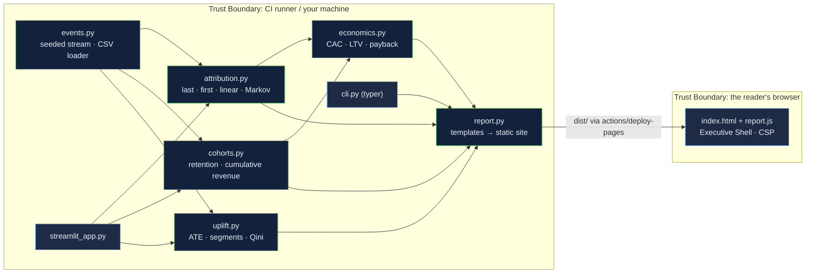

# Growth Analytics Engine: attribution, cohorts and uplift that say what they can and cannot know

[](https://github.com/Freddricklogan/growth-analytics-engine/actions/workflows/deploy.yml)
[](#5-getting-started--verification)
[](https://github.com/Freddricklogan/growth-analytics-engine/actions/workflows/codeql.yml)
[](LICENSE)
[](https://freddricklogan.github.io/growth-analytics-engine/)

## 1. Executive Summary & Business Impact

**Problem statement.** Enrolment and growth reporting routinely answers
four questions with one number each — which channel earned the sign-up,
whether the sign-ups stay, whether the campaign worked, and what a customer
costs against what they return — and rarely says which of those numbers is
an accounting convention and which is a measurement. Last-touch credit gets
read as cause; a lift in conversion during a campaign gets read as the
campaign; lifetime value gets extrapolated from cohorts too young to have
lived it.

**Solution & value delivered.** A typed Python package that computes all
four on one event stream and labels each honestly. Four attribution models
(last, first, linear, Markov removal effect) sit side by side, with a rank
comparison against the generator's known channel effects. Cohort retention
and cumulative revenue are shown only where observed. Uplift comes from a
randomised treatment with a confidence interval, overall and by segment,
with a Qini curve for targeting. CAC and LTV use the Markov credits and the
cohort curve at a stated horizon. CI runs the package on a seeded synthetic
stream and publishes the report, so every number on the live page was
computed by the run that published it. On the shipped seed the finding is
the point: no attribution model recovers the true channel ranking (best
Spearman +0.54, Markov −0.26), while the randomised campaign shows a real
effect concentrated in one segment.

**[→ Read the full case study](docs/CASE_STUDY.md)**

| Outcome | How this repo delivers it |
| --- | --- |
| Credit that adds up | Every model returns credits summing to observed conversions; the table shows them per channel with the Markov-vs-last swing |
| Cause kept separate from credit | The attribution section states it is accounting; the uplift section is the only causal estimate, from random assignment |
| No extrapolated retention | Unobserved cohort months are blank (`NaN`), averaged only over cohorts that lived them |
| Unit economics with a stated horizon | `channel_economics()` takes the horizon explicitly and raises if no cohort has observed it |
| Reproducible by anyone | `growth-engine report --seed 42` regenerates the live page; a Streamlit app takes your own journeys CSV |

## 2. Demonstrated Competencies & Technical Skills

- **Systems Architecture & CS** — `src/` layout, `pyproject.toml`, `uv`;
  `mypy --strict` over package and tests; pure functions over NumPy arrays
  and dataclasses; a report generator that emits a CSP-safe static site from
  string templates.
- **Data Science & AI** — absorbing Markov chains solved as a linear system
  for removal effects, cohort matrices with size-weighted averages, two-
  proportion uplift with Wald intervals, Qini curves, Spearman rank
  agreement; every formula tested against hand arithmetic.
- **Cybersecurity & Compliance** — `bandit`, `pip-audit`, Trivy and CodeQL
  (Python and JavaScript) in CI; the report page ships with
  `default-src 'none'` and no inline script; the CSV loader validates every
  row and reports rejects instead of coercing them.
- **EdTech & Human-Centered Design** — framed as enrolment marketing for a
  professional programme; the tour walks from the flattering last-touch
  column to the one number on the page that measures cause.

## 3. System Architecture & Data Flow



## 4. Technical Highlights & Engineering Decisions

### ADR-1 — Give the generator a known causal structure

**Context.** Analytics code is usually tested against itself: the Markov
model agrees with the Markov model.

**Decision.** `events.py` states per-channel logit effects, a segment
effect, a treatment that helps one segment only, and a churn hazard. Tests
check that uplift finds the treated segment and that no attribution model
matches the true ranking; the report prints the Spearman agreement.

**Consequence.** The page can say what attribution is and is not, with a
number, rather than asserting it.

### ADR-2 — Solve the Markov chain, do not simulate it

**Context.** Removal effects are often estimated by random walks over the
transition graph, which adds noise and a seed to a deterministic quantity.

**Decision.** `conversion_probability()` partitions the matrix into
transient and absorbing states and solves (I − Q)·x = R for the absorption
probability; removal redirects a channel's inbound mass to the null state.
A four-journey example is solved by hand in the tests.

**Consequence.** Exact, fast, and reproducible; credits sum to observed
conversions by construction.

### ADR-3 — Refuse to report what no cohort has observed

**Context.** LTV at month 12 from cohorts that are four months old is a
forecast dressed as a measurement.

**Decision.** The cohort matrix holds `NaN` beyond each cohort's observed
window; averages weight only observing cohorts; `ltv_at()` and
`channel_economics()` raise on an unobserved horizon; payback prints
"not within window" rather than a number.

**Consequence.** The horizon is a visible parameter of every economic
figure on the page.

## 5. Getting Started & Verification

**Prerequisites.** Python 3.12, [`uv`](https://docs.astral.sh/uv/).

```bash
git clone https://github.com/Freddricklogan/growth-analytics-engine.git
cd growth-analytics-engine
uv venv && uv pip install -e ".[dev,app]"
make check                              # lint → typecheck → test → security → build
uv run growth-engine report --out dist  # the static report
uv run streamlit run streamlit_app.py   # the interactive app
```

**Verification — the numbers this repository actually produced:**

```bash
uv run pytest --cov      # 28 passed · TOTAL 99% (statements + branches)
uv run ruff check .      # All checks passed
uv run ruff format --check .
uv run mypy              # Success: no issues found in 14 source files
uv run bandit -q -r src  # Low 0 · Medium 0 · High 0
uv run pip-audit --skip-editable  # No known vulnerabilities found
```

| Check | Result |
| --- | --- |
| Unit tests | **28 passed / 28** across 6 files |
| Coverage | **99%** (statements + branches) |
| ruff, ruff format, `mypy --strict` | clean, 14 source files |
| bandit / pip-audit | 0 findings / no known vulnerabilities |
| Report (seed 42, 6,000 prospects, 18 months) | 1,112 enrolments (18.5%); Spearman agreement with true channel effects: last +0.54, first −0.31, linear −0.09, Markov −0.26; campaign effect +4.0 pts (CI +2.1 to +6.0), lapsed segment +11.8 pts, other segments not significant; blended LTV:CAC at M6 1.82, payback month 3 |
| Headless Chrome smoke (built report) | **0 console errors**; shell KPIs from embedded JSON; five tour steps; no horizontal scroll at 1280 or 400 px |

## 6. Live Demo & Production Showcase

**<https://freddricklogan.github.io/growth-analytics-engine/>** — the
report CI generated from the package on seed 42.

**30-second guided walkthrough.** Press **Take the 30-second tour**.

1. **What this page is** — a CI build artefact, reproducible by one command.
2. **Last touch flatters the closer** — the largest Markov-vs-last swing,
   and the rank agreement row.
3. **Retention, not sign-ups** — blank cells are unobserved, not zero.
4. **A randomised campaign, read by segment** — the only causal number.
5. **Cost and return per channel** — CAC from Markov credits, LTV at a
   stated horizon.

For your own data: `uv run streamlit run streamlit_app.py` and upload a CSV
with `user_id`, `path` (`a > b > c`) and `converted`. The Streamlit app is
not hosted; it runs locally.
